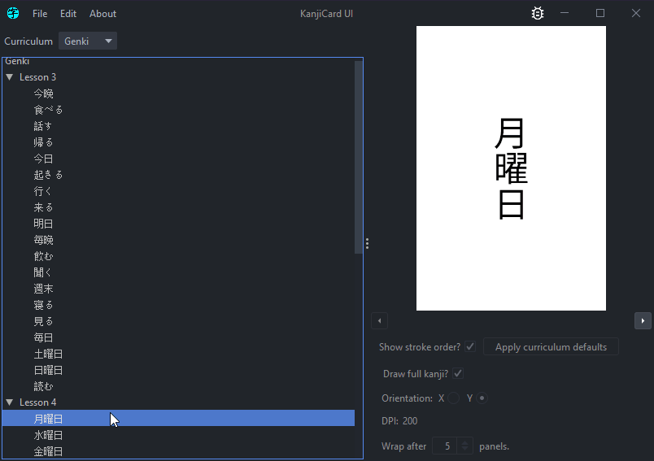
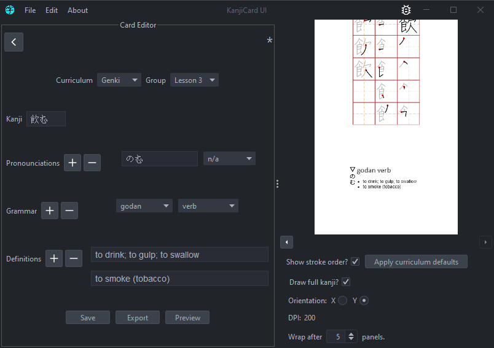
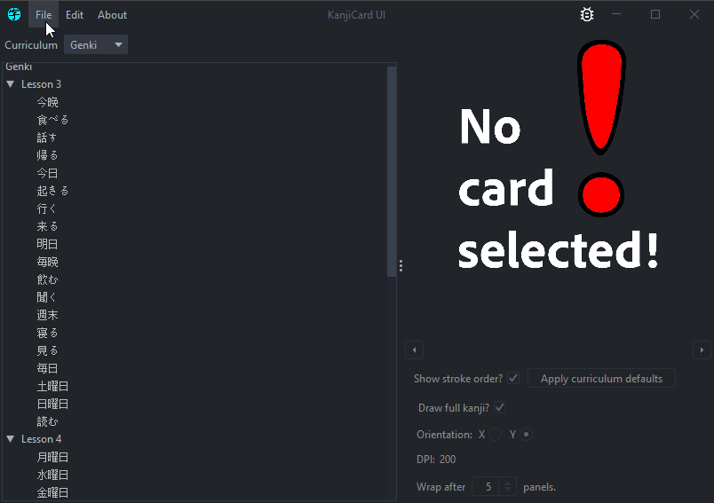

# kcui
temporary name 

# Cool things to check out 
(it's worth importing into intellij to ctrl+click & optionally run)

- [ExportJob#getResult](https://github.com/vhagedorn/kcui/blob/8291af0a022fc3da3ae22bdff987c5d839322775/src/main/java/me/vadim/ja/kc/render/impl/ctx/ExportJob.java#L68) -- multithreading solution
- [KCIcon](https://github.com/vhagedorn/kcui/blob/8291af0a022fc3da3ae22bdff987c5d839322775/src/main/java/me/vadim/ja/kc/ui/KCIcon.java#L15) -- enum usage (my fav Java feature)
- [psvm](https://github.com/vhagedorn/kcui/blob/8291af0a022fc3da3ae22bdff987c5d839322775/src/main/java/me/vadim/ja/Main.java#L10) -- my attempt at abstracting app & impl
- [InMemoryFileServer](https://github.com/vhagedorn/kcui/blob/8291af0a022fc3da3ae22bdff987c5d839322775/src/main/java/me/vadim/ja/kc/render/InMemoryFileServer.java#L24) -- http server layer
- [back.html](https://github.com/vhagedorn/kcui/blob/31f27f6c757abf488a0c51278eaf1e310cf71ae5/src/main/resources/doc/back.html#L68) -- relevant CSS snippet

# screenshots

- **preview/explorer**:

  

- **export**:

- **batch export**:

- **[exported PDFs](https://github.com/vhagedorn/kcui/tree/master/doc)**
